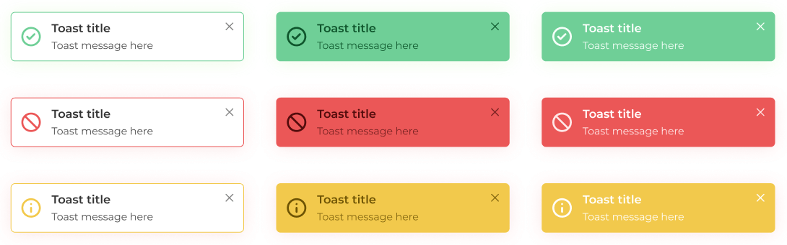

# Simple Notify

Simple Notify is a pure Javascript library to show nice and customizable alert notifications.

[Live Demo](https://simple-notify.github.io/simple-notify/)



## Install

```bash
npm i simple-notify
```

```js
import Notify from 'simple-notify'
import 'simple-notify/dist/simple-notify.min.css'
```

## Include

```html
<!-- CSS -->
<link rel="stylesheet" href="https://cdn.jsdelivr.net/npm/simple-notify@0.5.5/dist/simple-notify.min.css" />

<!-- JS -->
<script src="https://cdn.jsdelivr.net/npm/simple-notify@0.5.5/dist/simple-notify.min.js"></script>
```

## Parameters

| Parameter                                   | Type    | Values                                                                                                                                       |    Default    |
| :------------------------------------------ | :------ | :------------------------------------------------------------------------------------------------------------------------------------------- | :-----------: |
| `status`                                    | String  | `'error'`, `'warning'`, `'success'`                                                                                                          |    `null`     |
| `title`                                     | String  |                                                                                                                                              |    `null`     |
| `text`                                      | String  | You can send any type of html.                                                                                                               |    `null`     |
| `customIcon`                                | String  | You can send any type of html.                                                                                                               |    `null`     |
| `customClass`                               | String  |                                                                                                                                              |    `null`     |
| `speed`                                     | Number  | transition-duration in milliseconds.                                                                                                         |      300      |
| `effect`                                    | String  | `'fade'`, `'slide'`                                                                                                                          |   `'fade'`    |
| `showIcon`                                  | Boolean |                                                                                                                                              |     true      |
| `showCloseButton`                           | Boolean |                                                                                                                                              |     true      |
| `autoclose`                                 | Boolean |                                                                                                                                              |     false     |
| `autotimeout` (valid only with `autoclose`) | Number  |                                                                                                                                              |     3000      |
| `gap` (margin between notifications)        | Number  |                                                                                                                                              |      20       |
| `distance` (distance to edges)              | Number  |                                                                                                                                              |      20       |
| `type` (just for design)                    | Number  | 1, 2, 3                                                                                                                                      |       1       |
| `position`                                  | String  | Combine x and y position. `'left'`, `'right'`, `'top'`, `'bottom'`, `'x-center'`, `'y-center'` or use only `'center'` to center both x and y | `'right top'` |

<sub>All parameters are optional but you must specify 'title' or 'text' at least.</sub>

## Functions

| Function | Description                                                       |
| :------- | :---------------------------------------------------------------- |
| close()  | You can close the notification manually using the close function. |

## How to use

Just create a new instance, notification will be sent immediately. Full example:

```js
function pushNotify() {
  new Notify({
    status: 'success',
    title: 'Notify Title',
    text: 'Notify text lorem ipsum',
    effect: 'fade',
    speed: 300,
    customClass: null,
    customIcon: null,
    showIcon: true,
    showCloseButton: true,
    autoclose: false,
    autotimeout: 3000,
    gap: 20,
    distance: 20,
    type: 1,
    position: 'right top'
  })
}
```

Close manually:

```js
let myNotify

function pushNotify() {
  myNotify = new Notify({
    status: 'success',
    title: 'Notify Title',
    text: 'notify text',
    effect: 'slide',
    type: 3
  })
}

function close() {
  myNotify.close()
}
```

## CSS

The colors and some sizes can be customized easily using CSS variables. You can overwrite them in `.notify` or your custom class, or change it directly in the css file.

```css
.notify {
  /* defaults */
  --notify-error: #eb5757;
  --notify-success: #6fcf97;
  --notify-warning: #f2c94c;
  --notify-gray: #333333;
  --notify-gray-2: #4d4d4d;
  --notify-gray-3: #828282;
  --notify-white: #fff;
  --notify-white-2: rgba(255, 255, 255, 0.8);
  --notify-padding: 0.75rem;
  --notify-icon-size: 32px;
  --notify-close-icon-size: 16px;
}
```

## Do you need another feature?

If you want any feature, just open an issue and make sure I'll add it ASAP. Also feel free to send PR, contributions are welcomed.

## Credits

Designed by [Prabesh Shakya](https://www.figma.com/@prabesh)
